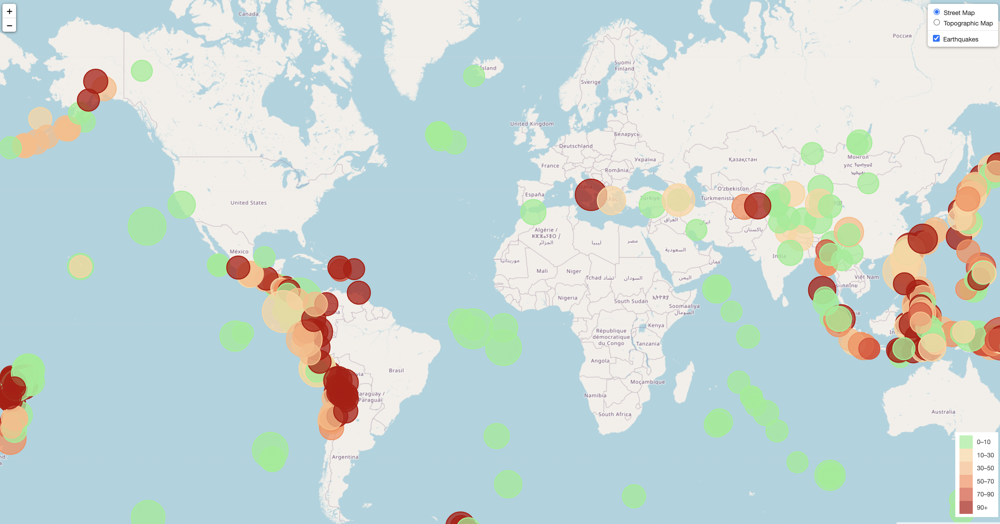

Summary/Problem: This repo contains documents for Homework Assignment 15 for the U of M Data Analytics Bootcamp. The goal of this project was to obtain geoJSON data from USGS and to create a visualization using Leaflet that shows the location of recent earthquaked along with the magnitude denoted by the size of the circle and the depth of the earthquake denoted by the color.

***
This Repo Contains the Following:

1. Leaflet-Part-1
    * static
        * css - contains style.css
        * js - contains logic.js which works through the geojson and data
    * index.html - code for index page
1. Leaflet-Part-2 - no code provided yet. further analysis yet to be completed.
***
